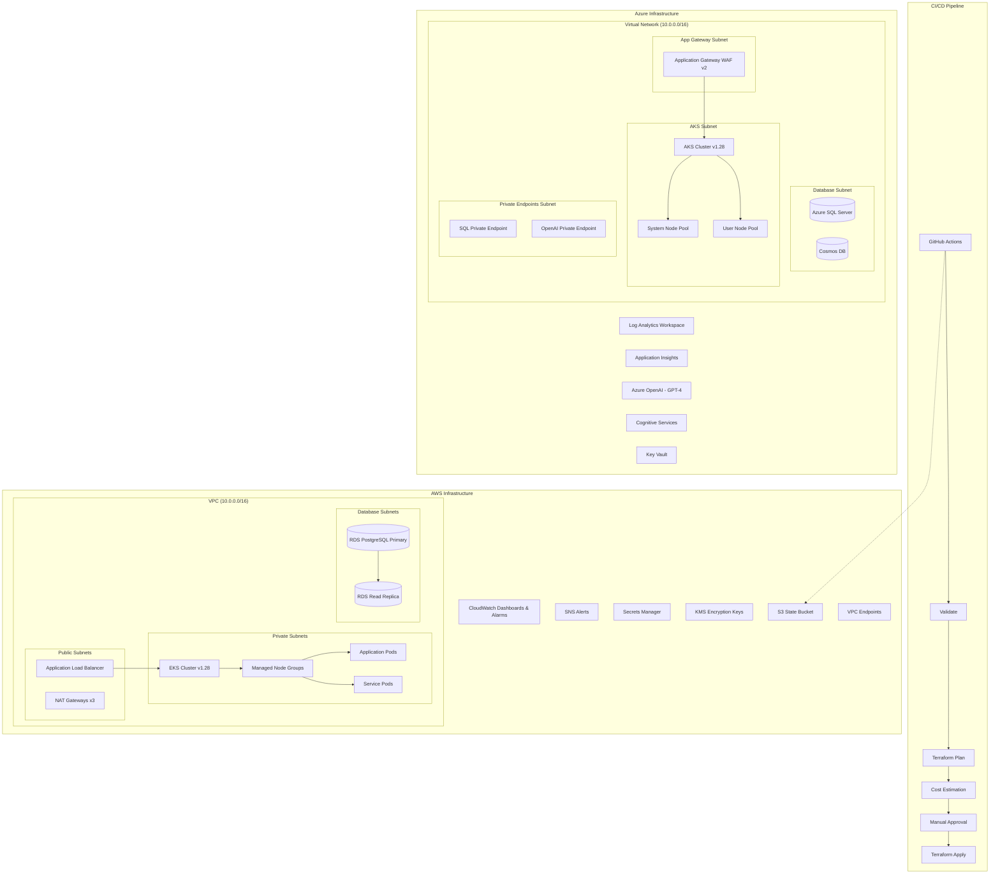

# Architecture Documentation

## System Overview

This document describes the cloud infrastructure architecture deployed across AWS and Azure using Terraform and Azure Bicep. The architecture follows enterprise best practices for security, high availability, and operational excellence.

## Architecture Diagram



## Network Architecture

### AWS VPC Design

| Subnet Tier | CIDR Range | Purpose | Internet Access |
|-------------|------------|---------|-----------------|
| Public | 10.0.0.0/24 - 10.0.2.0/24 | Load balancers, NAT Gateways | Direct (IGW) |
| Private | 10.0.3.0/24 - 10.0.5.0/24 | EKS nodes, application workloads | Outbound only (NAT) |
| Database | 10.0.6.0/24 - 10.0.8.0/24 | RDS instances | None (isolated) |

**Key Design Decisions:**
- One NAT Gateway per AZ for fault isolation
- VPC endpoints for S3, ECR, and STS to reduce data transfer costs
- Network ACLs as an additional defense layer
- VPC Flow Logs enabled for audit and troubleshooting

### Azure VNet Design

| Subnet | CIDR Range | Purpose |
|--------|------------|---------|
| AKS | 10.0.0.0/20 | Kubernetes cluster nodes and pods |
| App Gateway | 10.0.16.0/24 | WAF and ingress |
| Database | 10.0.17.0/24 | SQL Server and databases |
| Private Endpoints | 10.0.18.0/24 | Private Link connections |
| App Service | 10.0.19.0/24 | Web applications |
| Management | 10.0.20.0/24 | Bastion and management tools |

## Compute Architecture

### Kubernetes (EKS / AKS)

Both clusters are configured with:
- **Version**: Kubernetes 1.28 with automatic minor version upgrades
- **Node Pools**: System pool (infrastructure) + User pool (workloads)
- **Autoscaling**: Cluster Autoscaler (AWS) / Node pool autoscaler (Azure)
- **Identity**: IRSA (AWS) / Workload Identity (Azure)
- **Security**: Secrets encryption at rest (KMS/Key Vault), network policies (Calico)
- **Monitoring**: Container Insights with Log Analytics / CloudWatch

### Scaling Strategy

| Environment | Min Nodes | Max Nodes | Instance Type |
|-------------|-----------|-----------|---------------|
| Dev | 2 | 5 | m6i.xlarge / Standard_D4s_v5 |
| Staging | 2 | 8 | m6i.xlarge / Standard_D4s_v5 |
| Production | 3 | 10 | m6i.2xlarge / Standard_D8s_v5 |

## Database Architecture

### AWS RDS PostgreSQL
- **Engine**: PostgreSQL 15.4
- **High Availability**: Multi-AZ deployment with synchronous replication
- **Read Scaling**: Read replica in production
- **Encryption**: AES-256 encryption at rest via KMS, TLS 1.2+ in transit
- **Backups**: 30-day automated backup retention, point-in-time recovery
- **Performance**: Performance Insights enabled (731 days retention in prod)
- **Monitoring**: Enhanced monitoring at 60-second intervals

### Azure SQL Database
- **Tier**: General Purpose Gen5
- **High Availability**: Zone-redundant in production
- **Encryption**: Transparent Data Encryption (TDE)
- **Backups**: Short-term (30 days) + Long-term retention in production
- **Threat Detection**: Enabled with email alerts
- **Private Access**: Private endpoint (no public network access in prod)

### Azure Cosmos DB
- **Consistency**: Session consistency level
- **Distribution**: Geo-redundant in production
- **Capacity**: Serverless for dev, provisioned for production
- **Partitioning**: Partition key on `/tenantId` for multi-tenant workloads

## AI Services Architecture

### Azure OpenAI
- **Model**: GPT-4 (version 0613)
- **Deployment**: Standard scale with capacity 10
- **Security**: Private endpoint in production, network ACLs
- **Monitoring**: Diagnostic settings to Log Analytics

### Azure Cognitive Services
- **Type**: Multi-service account (CognitiveServices)
- **Use Cases**: Vision, Language, Speech, Decision APIs

## Security Architecture

### Identity & Access Management

| AWS | Azure | Purpose |
|-----|-------|---------|
| IAM Roles + IRSA | Managed Identity + Workload Identity | Service authentication |
| KMS | Key Vault | Key management |
| Secrets Manager | Key Vault Secrets | Credential storage |
| Security Groups | NSGs | Network filtering |
| NACLs | NSG Rules | Network defense |

### Encryption Strategy

- **At Rest**: KMS (AWS) / Key Vault + TDE (Azure) for all data stores
- **In Transit**: TLS 1.2+ enforced everywhere
- **Secrets**: Auto-rotated via Secrets Manager / Key Vault
- **Kubernetes Secrets**: Encrypted at the etcd level (KMS envelope encryption)

### Network Security
- Private subnets for all compute and database workloads
- VPC endpoints / Private endpoints for AWS/Azure service access
- Network policies (Calico) for pod-to-pod communication
- WAF (Application Gateway WAF v2) for web traffic
- NSGs/Security Groups following least-privilege principle

## Monitoring & Observability

### AWS Monitoring Stack
- **CloudWatch Dashboards**: Infrastructure overview with EKS and RDS metrics
- **CloudWatch Alarms**: CPU, memory, storage, connection, and replica lag alerts
- **Container Insights**: Pod-level metrics and logs
- **VPC Flow Logs**: Network traffic analysis
- **SNS**: Multi-channel alert notifications

### Azure Monitoring Stack
- **Log Analytics**: Centralized log aggregation
- **Application Insights**: APM and distributed tracing
- **Container Insights**: AKS monitoring
- **Metric Alerts**: CPU, memory, and service health
- **Action Groups**: Email and webhook notifications

### Alert Thresholds

| Metric | Warning | Critical | Evaluation |
|--------|---------|----------|------------|
| CPU Utilization | 70% | 80% | 15 min avg |
| Memory Utilization | 75% | 80% | 15 min avg |
| Free Storage | 20 GB | 10 GB | 10 min avg |
| Database Connections | 300 | 400 | 10 min avg |
| Replica Lag | 15 sec | 30 sec | 15 min max |
| Pod Restarts | 3 | 5 | 5 min max |

## Deployment Architecture

### Environment Strategy

| Environment | Purpose | Auto-approve | Backup | HA |
|-------------|---------|-------------|--------|-----|
| Dev | Development & testing | Yes | Minimal | No |
| Staging | Pre-production validation | No | Standard | Partial |
| Production | Live workloads | No (manual gate) | Full | Full |

### State Management
- **AWS**: S3 bucket with DynamoDB locking, encryption at rest
- **Azure**: Azure Storage Account with blob locking
- **Workspaces**: Environment isolation via Terraform workspaces

### CI/CD Pipeline Flow

```
Push to PR → Validate → Plan → Cost Estimate → Review
                                                   ↓
                                            Merge to main
                                                   ↓
                                    Manual Trigger → Plan → Approve → Apply
```

## Cost Optimization

- **Right-sizing**: Environment-specific instance types
- **Auto-scaling**: Scale down in non-production environments
- **Reserved capacity**: RIs/Savings Plans for production workloads
- **Spot instances**: Available for non-critical batch workloads
- **VPC Endpoints**: Reduce NAT Gateway data transfer costs
- **Serverless**: Cosmos DB serverless tier for development
- **Cost estimation**: Infracost integration in CI/CD pipeline

## Disaster Recovery

| Component | RPO | RTO | Strategy |
|-----------|-----|-----|----------|
| EKS/AKS | 0 (stateless) | 15 min | Multi-AZ + Autoscaling |
| RDS PostgreSQL | 5 min | 30 min | Multi-AZ + Read Replica |
| Azure SQL | 5 min | 30 min | Zone-redundant + Failover |
| Cosmos DB | 0 | < 5 min | Geo-redundant |
| Configuration | 0 | 15 min | Git + Terraform state |
